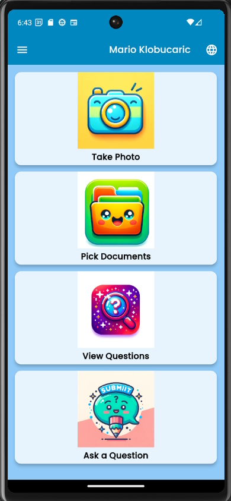
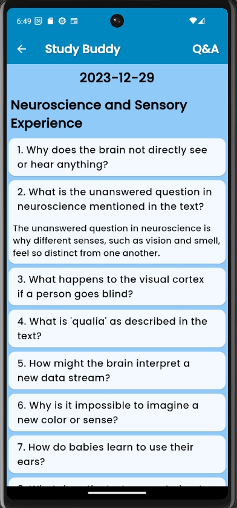
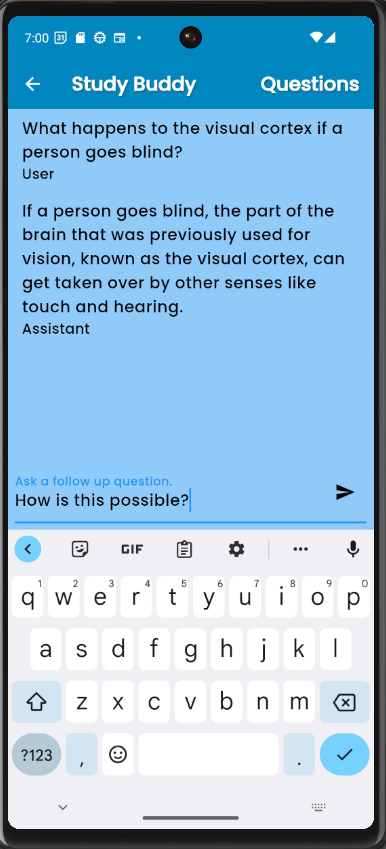

# Educational Assistant App Study Buddy

## Introduction
Educational Assistant App is designed to support children in their learning journey, offering an interactive and engaging way to check their knowledge. This app is built using Flutter and is available for both mobile and web platforms.

## Table of Contents
- [Features](#features)
- [Usage](#usage)
- [App screenshots](#app-screenshots)
- [Backend Integration](#backend-integration)
- [ToDo: Token Counting and Billing](#todo-token-counting-and-billing)
- [License](#license)

## Features
- **User Roles:** Admin, Subscriber, Guest
- **Multi-language Support:** EN, DE, HR, HU
- **Kids-Friendly Interface**
- **Backend Integration:** Google Vision, OpenAI, Firebase, Firestore

## Usage
For a guide on using the app, refer to the [User Manual](UserManual.md).

## App screenshots

 
<b>Apps Home, Q&A and Follow-Up Questions View</b>

## Backend Integration:
The app integrates with backend of the Educational Assistant App, visit [Study Buddy Backend](https://github.com/mklobucaric/studybuddy-backend). 

## ToDo: Token Counting and Billing
Token counting and billing functionalities are under development.

## License
This project is licensed under [include license here].

