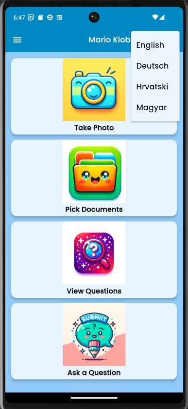
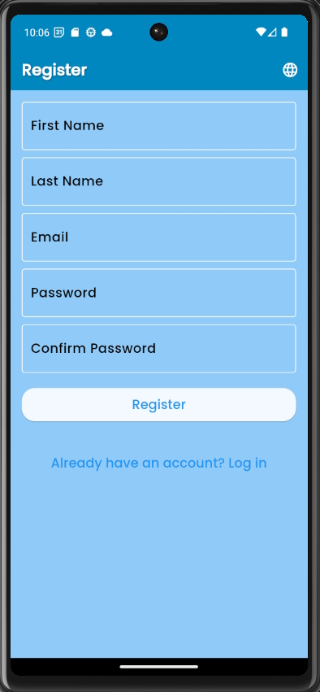
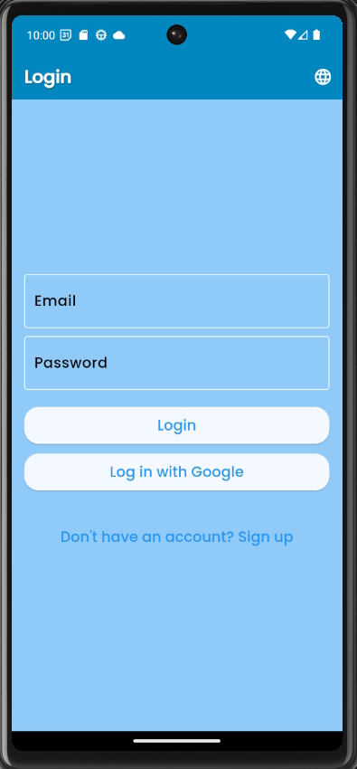
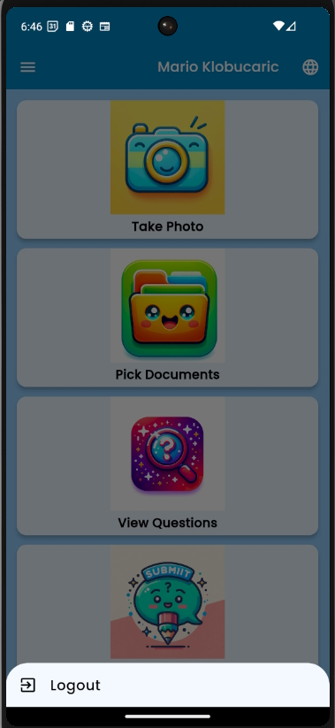
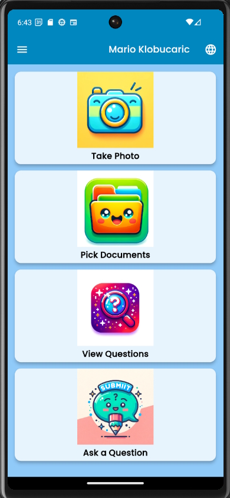
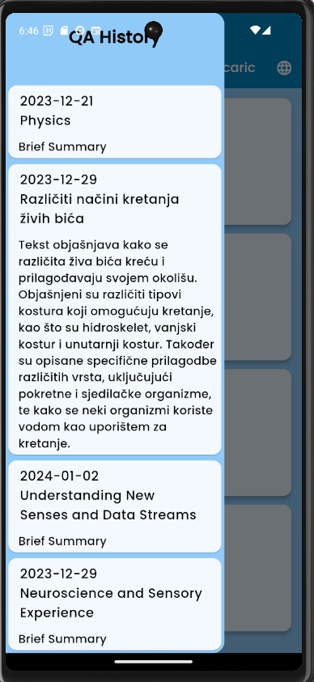
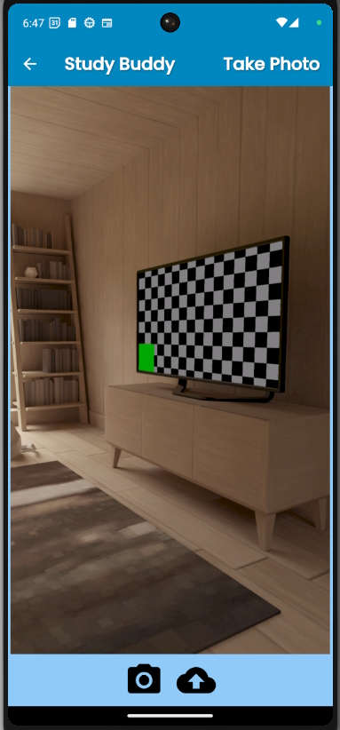
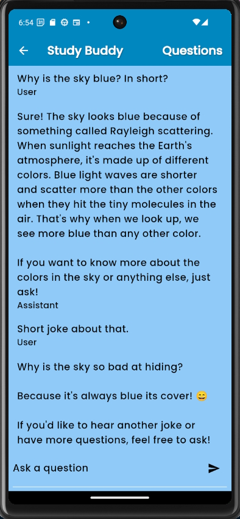

# User Manual for the Educational Assistant App Study Buddy

## Introduction
This manual provides detailed instructions on how to use Educational App.

## Table of Contents
- [App Features](#app-features)
- [Navigating the App](#navigating-the-app)
- [Detailed Feature Use](#detailed-feature-use)
- [Screenshots](#screenshots)

## App Features
- **User Roles:** Admin, Subscriber, and Guest. New users are guests by default and have limited access.
- **Localization:** Supports English, German, Croatian, and Hungarian.  
- **Kids-Friendly Interface:** Designed to be user-friendly for children both in user interface and AI tutor responses.

## Navigating the App
- **Registration:** Option to register with email  
- **Login:** Options to login with email or Google.   
- **Logout:** Option to logout is displayed upon clicking on the user name.   
- **Home View:** Access to main features like Take Photo, Pick Documents, View Questions, and Ask a Custom Question.  
- **History in Left Drawer:** This section is designed to provide a quick overview and efficient navigation for past activities.
  - **Display Elements:** Each entry displays the date, subject, and a brief summary.
  - **Interaction Details:**
    - **Expand/Collapse Summary:** Clicking on the 'Brief Summary' text will expand the summary to provide more details. Clicking again will retract it to the brief view.
    - **Navigation to QA View:** Clicking on either the date or the subject of an entry will route the user to the relevant QA view, providing a more detailed exploration of that particular activity. 
  
- **Easy Navigation to Home:** In any view other than the Home view, users can quickly return to the Home view by clicking on the "Study Buddy" text. This offers a convenient and quick way to navigate back to the main dashboard from any part of the app.

### Detailed Feature Use
- **Take Photo:** This feature allows users to capture images of text or materials for assistance.
  - **Functionality:**
    - **Image Capture:** Users can take photos of text or materials they need help with.
    - **Q&A Generation and Navigation:** After capturing the image, users can click the 'send' icon. This action sends the photo for processing, whereupon a Questions & Answers session is generated based on the text in the image. 
  - **User Experience:** Upon completion of Questions & Answers generation, the app automatically routes the user to the relevant QA view. This view displays the generated Q&A, providing interactive and informative assistance based on the captured content. 
  

- **Pick Documents:** This feature enables users to select and upload multiple images from their local storage for analysis and assistance.
  - **Upload Process:**
    - **Multiple Selections:** Users can choose multiple images containing text from their local storage. This flexibility allows for a comprehensive analysis of longer text documents at once.
    - **Initiating Analysis:** After selecting the desired images, users can proceed by clicking the 'send' icon or an equivalent action button.
  - **Q&A Generation:** Upon uploading the images, the app processes the text within them to generate a customized Questions & Answers session.
  - **Navigation to QA View:** Post-analysis, users are automatically directed to the QA view. This view presents the generated Questions & Answers, offering an interactive and informative exploration based on the text from the uploaded documents.  
   

  - **View Questions:** This view showcases the questions generated from the images uploaded through the 'Take Photo' or 'Pick Documents' features.
  - **Interactive Q&A Display:**
    - **Question Expansion:** Initially, only questions are displayed. Clicking on a specific question will expand the view to reveal the associated answer below it.
    - **Answer Retraction:** Clicking again on the same question will retract the answer, collapsing it back into the question-only view.
  - **In-depth Exploration:**
    - **Requesting Further Explanations:** If users require additional explanations about a particular question and answer, they can click on the answer. This action redirects them to a dedicated view.
    - **Expanded QA View:** In this view, the selected question and answer are displayed at the top, followed by an input field at the bottom where users can pose additional questions.
  - **Interactive Learning with AI:**
    - **Processing New Questions:** Users can send their new questions for processing. The AI analyzes the relevant parts of the originally uploaded text and generates a kid-friendly answer based on this context and general knowledge.
    - **Iterative Questioning:** Users can ask multiple follow-up questions. Each time, the AI decides whether to refer to the saved text or to rely on its general knowledge for the response.
    - **Formatted Conversation Display:** The exchange between the user and the AI assistant is displayed in a conversational format: User questions and AI responses are clearly demarcated for easy understanding. 
    

       
      
    
 
- **Ask a Question:** This view is dedicated to interacting directly with the AI tutor for general inquiries.
  - **Functionality:**
    - **Initial Setup:** Unlike the 'Follow Up Questions' view, this section starts without any pre-existing questions or answers.
    - **Custom Question Submission:** Users can freely type and submit any custom question they have in mind. This feature is designed to accommodate general inquiries that are not related to the uploaded text.
  - **AI Tutor Interaction:**
    - **Conversational Format:** Responses from the AI tutor are presented in a conversational style, maintaining a clear and engaging dialogue format. 
    - **General Knowledge Responses:** The AI tutor utilizes its extensive general knowledge base to provide informative and accurate answers, independent of previously uploaded texts.
    - **Iterative Engagement:** Users can continue the conversation by asking additional questions, fostering an interactive learning environment.
  - **User Experience:**
    - **Streamlined Interface:** The layout is designed for ease of use, allowing users to focus on their questions and the AI's responses without distraction.
    - **Real-time Interaction:** Questions are processed and answered in real time, offering a dynamic and responsive educational experience. 
   

## Screenshots
- **Screenshots Folder:** Screenshots of the app can be found in the [`/screenshots`](/screenshots) directory.

